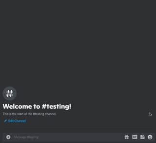
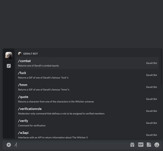
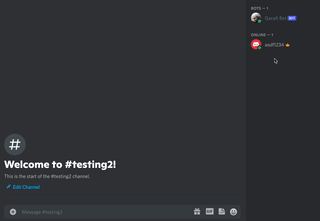
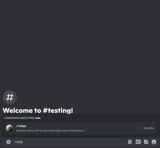

# Geralt Bot
A simple, open-source Discord bot that has commands reflecting the Witcher universe and, in particular, it's protagonist ~~Ravix of Fourhorn~~ Geralt of Rivia.

## Examples

- `/combat` returns one of Geralt's classic combat taunts from [the games](https://thewitcher.com)  

- `/hmm` and `/fuck` return GIFs of Geralt's iconic simple responses from the [Netflix series](https://www.netflix.com/title/80189685)  

- `/verificationrole` is a moderator-only command that defines a role for people verifying to obtain and `/verify` is used by members to be verified  

- `/w3api` is a command that returns information about different characters, creatures, and quests using [The Witcher 3 API](http://witcher3api.com/). (Currently only characters and creatures supported, queries and quests coming soon)    

## Credits
This bot was coded by [@ADawesomeguy](https://github.com/ADawesomeguy), and makes use of the Witcher 3 API available [here](http://witcher3api.com/).
